# Claude Code — Architecture Flowcharts

> High-fidelity Mermaid diagrams covering every major system, data flow, and protocol in the Claude Code Rust reimplementation.

---

## Table of Contents

1. [System Architecture — Crate Dependency Graph](#1-system-architecture--crate-dependency-graph)
2. [CLI Boot Sequence](#2-cli-boot-sequence)
3. [Agentic Query Loop](#3-agentic-query-loop)
4. [Tool Dispatch & Permission System](#4-tool-dispatch--permission-system)
5. [API Client — Streaming & Retry Logic](#5-api-client--streaming--retry-logic)
6. [Auto-Compaction Flow](#6-auto-compaction-flow)
7. [MCP Client Protocol](#7-mcp-client-protocol)
8. [Bridge Remote Control Protocol](#8-bridge-remote-control-protocol)
9. [TUI Rendering Pipeline](#9-tui-rendering-pipeline)
10. [OAuth Authentication Flow](#10-oauth-authentication-flow)
11. [Buddy Companion Generation](#11-buddy-companion-generation)
12. [Slash Command Dispatch](#12-slash-command-dispatch)
13. [Memory & Context Assembly](#13-memory--context-assembly)
14. [Session Persistence](#14-session-persistence)

---

## 1. System Architecture — Crate Dependency Graph

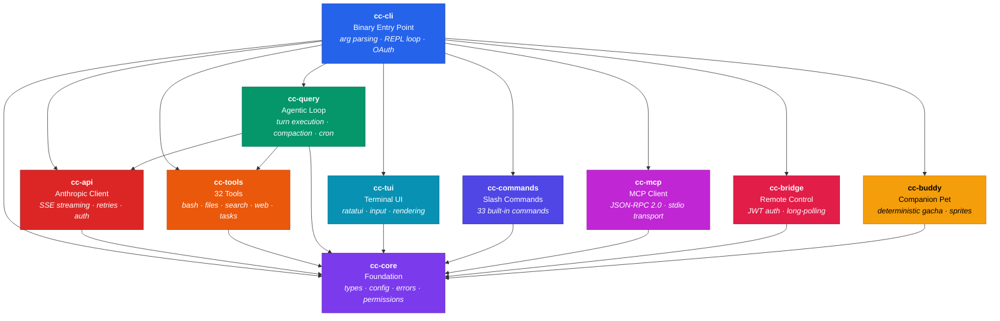

---

## 2. CLI Boot Sequence

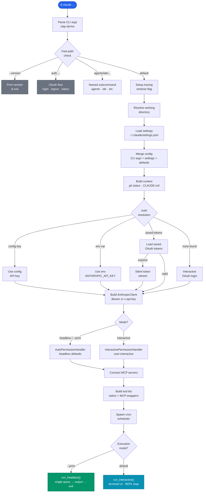

---

## 3. Agentic Query Loop

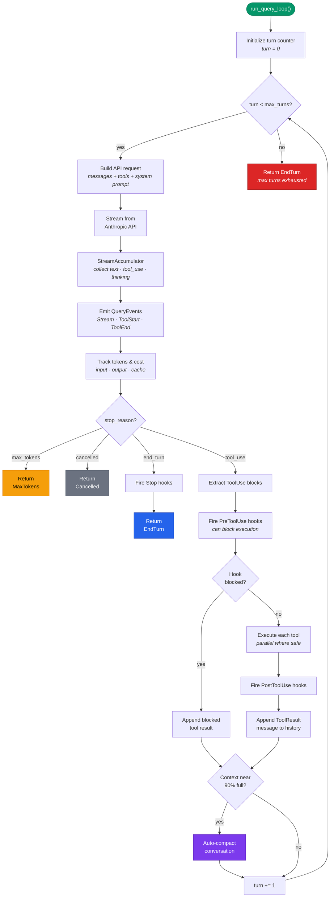

---

## 4. Tool Dispatch & Permission System

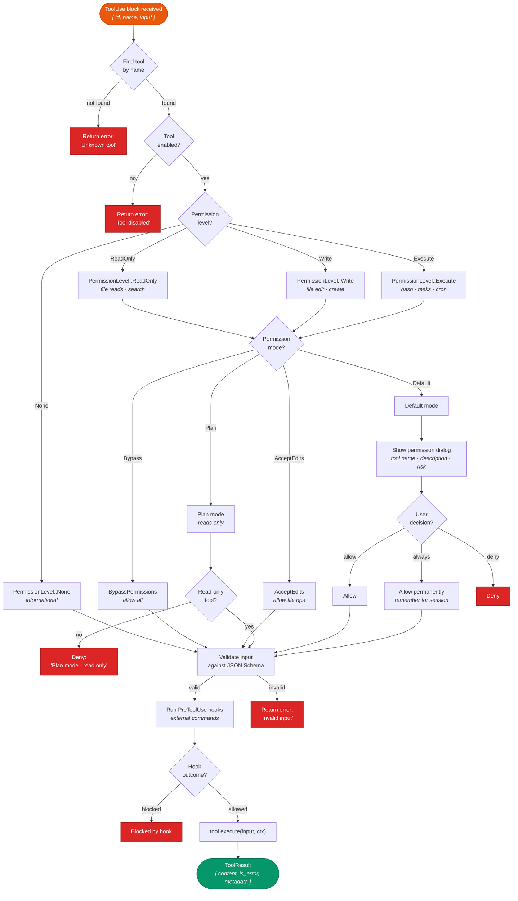

---

## 5. API Client — Streaming & Retry Logic

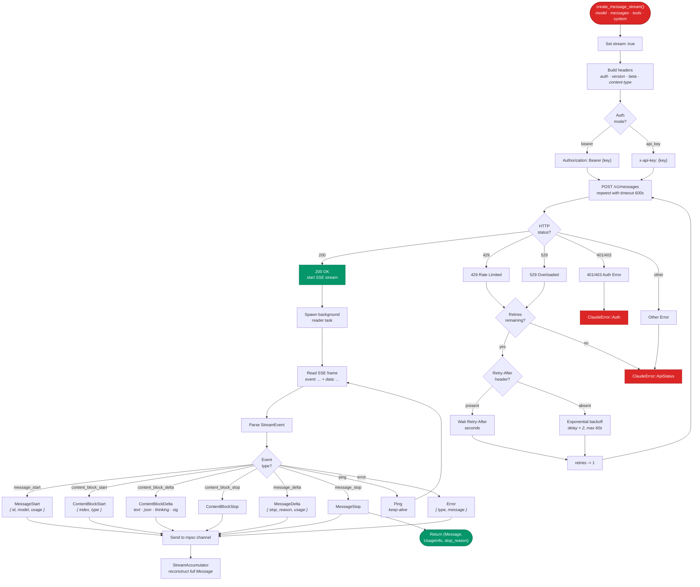

---

## 6. Auto-Compaction Flow

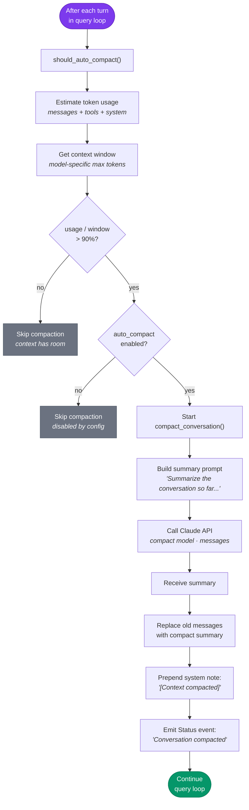

---

## 7. MCP Client Protocol

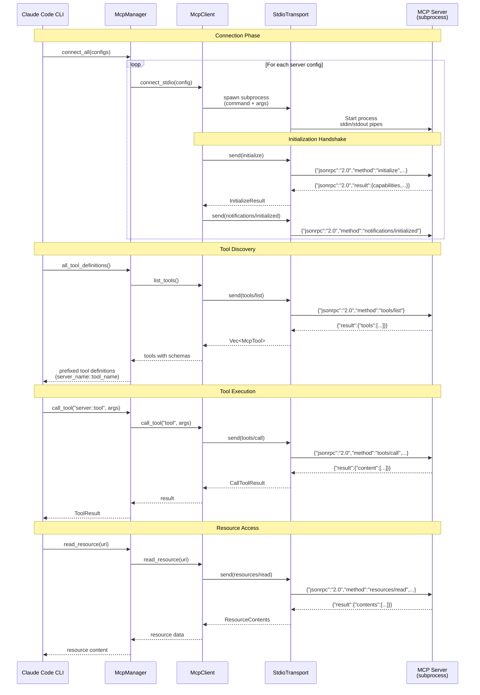

---

## 8. Bridge Remote Control Protocol

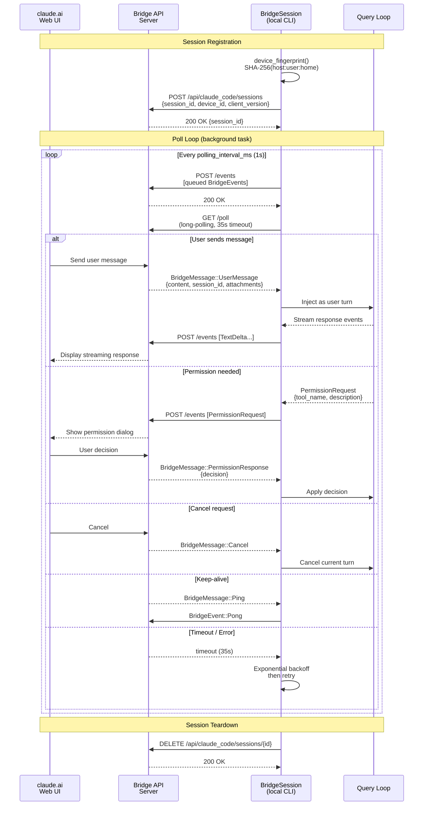

---

## 9. TUI Rendering Pipeline

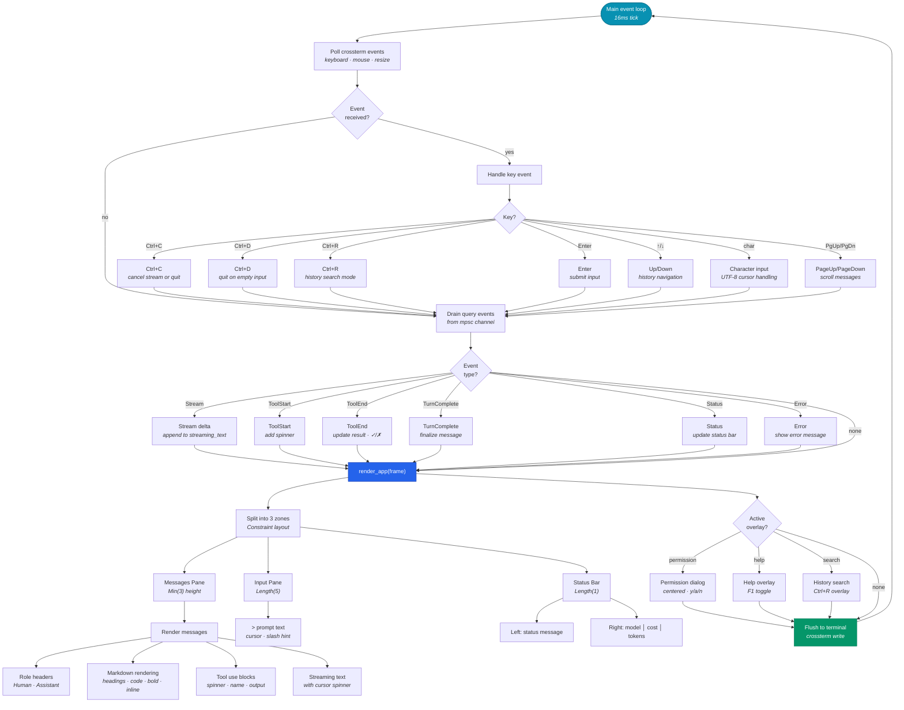

---

## 10. OAuth Authentication Flow

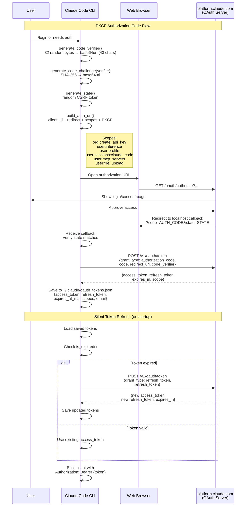

---

## 11. Buddy Companion Generation

```mermaid
flowchart TD
    INPUT(["user_id<br/><i>string</i>"])
    HASH["SHA-256(user_id + 'friend-2026-401')"]
    SEED["Extract first 4 bytes<br/>as u32 little-endian"]
    PRNG["Initialize Mulberry32<br/>PRNG(seed)"]

    ROLL_RARITY["Roll rarity<br/><i>next_f64()</i>"]
    RARITY{"Random<br/>value?"}
    COMMON["Common<br/><i>60% · floor=5</i>"]
    UNCOMMON["Uncommon<br/><i>25% · floor=15</i>"]
    RARE["Rare<br/><i>10% · floor=25</i>"]
    EPIC["Epic<br/><i>4% · floor=35</i>"]
    LEGENDARY["Legendary<br/><i>1% · floor=50</i>"]

    ROLL_SPECIES["Roll species<br/><i>18 options</i>"]
    SPECIES["Species assigned<br/><i>Duck · Goose · Blob · Cat ·<br/>Dragon · Octopus · Owl · Penguin ·<br/>Turtle · Snail · Ghost · Axolotl ·<br/>Capybara · Cactus · Robot ·<br/>Rabbit · Mushroom · Chonk</i>"]

    ROLL_EYE["Roll eye style<br/><i>6 options</i>"]
    EYES["Eye: · ✦ × ◉ @ °"]

    ROLL_HAT["Roll hat<br/><i>8 options</i>"]
    HAT_CHECK{"Rarity =<br/>Common?"}
    NO_HAT["Hat: None"]
    HAT["Hat: Crown · Tophat ·<br/>Propeller · Halo ·<br/>Wizard · Beanie · TinyDuck"]

    ROLL_SHINY["Roll shiny<br/><i>1% chance</i>"]
    SHINY{"Shiny?"}
    YES_SHINY["✨ Shiny variant"]
    NO_SHINY["Normal variant"]

    ROLL_STATS["Roll 5 stats"]
    STATS["Stats (floor-based):<br/><i>DEBUGGING · PATIENCE ·<br/>CHAOS · WISDOM · SNARK</i><br/><br/>Peak: floor + 50-79<br/>Dump: floor − 10-15<br/>Others: floor + 0-40"]

    BONES(["CompanionBones<br/><i>immutable · deterministic</i>"])

    SOUL_CHECK{"Soul exists in<br/>companion.json?"}
    LOAD_SOUL["Load CompanionSoul<br/><i>name · personality · hatched_at</i>"]
    GEN_SOUL["Generate soul via Claude<br/><i>AI-written name + personality</i>"]
    SAVE_SOUL["Save to<br/>~/.claude/companion.json"]

    COMPANION(["Complete Companion<br/><i>Bones + Soul</i>"])

    INPUT --> HASH --> SEED --> PRNG

    PRNG --> ROLL_RARITY
    ROLL_RARITY --> RARITY
    RARITY -->|"0.00 - 0.60"| COMMON
    RARITY -->|"0.60 - 0.85"| UNCOMMON
    RARITY -->|"0.85 - 0.95"| RARE
    RARITY -->|"0.95 - 0.99"| EPIC
    RARITY -->|"0.99 - 1.00"| LEGENDARY

    COMMON --> ROLL_SPECIES
    UNCOMMON --> ROLL_SPECIES
    RARE --> ROLL_SPECIES
    EPIC --> ROLL_SPECIES
    LEGENDARY --> ROLL_SPECIES

    ROLL_SPECIES --> SPECIES --> ROLL_EYE --> EYES --> ROLL_HAT
    ROLL_HAT --> HAT_CHECK
    HAT_CHECK -->|"yes"| NO_HAT --> ROLL_SHINY
    HAT_CHECK -->|"no"| HAT --> ROLL_SHINY

    ROLL_SHINY --> SHINY
    SHINY -->|"yes (1%)"| YES_SHINY --> ROLL_STATS
    SHINY -->|"no (99%)"| NO_SHINY --> ROLL_STATS

    ROLL_STATS --> STATS --> BONES

    BONES --> SOUL_CHECK
    SOUL_CHECK -->|"yes"| LOAD_SOUL --> COMPANION
    SOUL_CHECK -->|"no"| GEN_SOUL --> SAVE_SOUL --> COMPANION

    style INPUT fill:#f59e0b,stroke:#d97706,color:#000
    style COMPANION fill:#059669,stroke:#047857,color:#fff
    style BONES fill:#2563eb,stroke:#1e40af,color:#fff
    style YES_SHINY fill:#f59e0b,stroke:#d97706,color:#000
    style LEGENDARY fill:#7c3aed,stroke:#5b21b6,color:#fff
    style EPIC fill:#c026d3,stroke:#a21caf,color:#fff
    style RARE fill:#2563eb,stroke:#1e40af,color:#fff
    style UNCOMMON fill:#059669,stroke:#047857,color:#fff
    style COMMON fill:#6b7280,stroke:#4b5563,color:#fff
```

---

## 12. Slash Command Dispatch

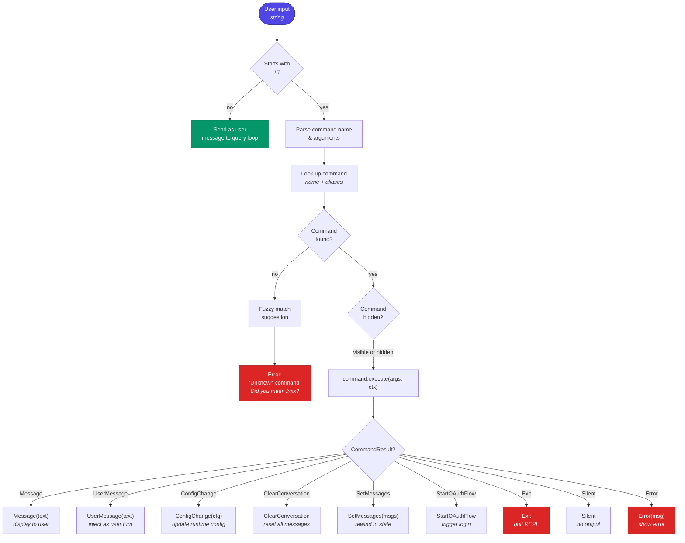

---

## 13. Memory & Context Assembly

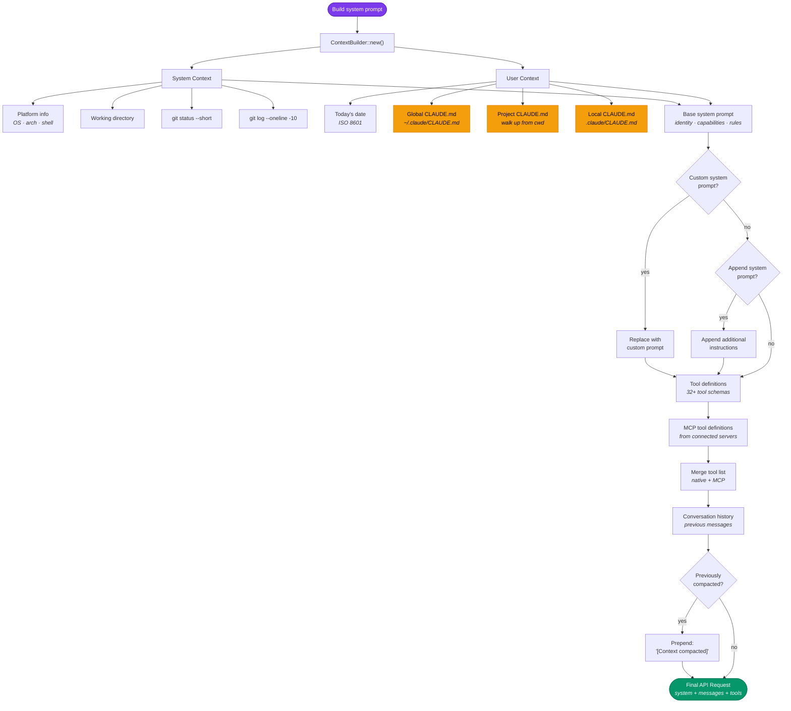

---

## 14. Session Persistence

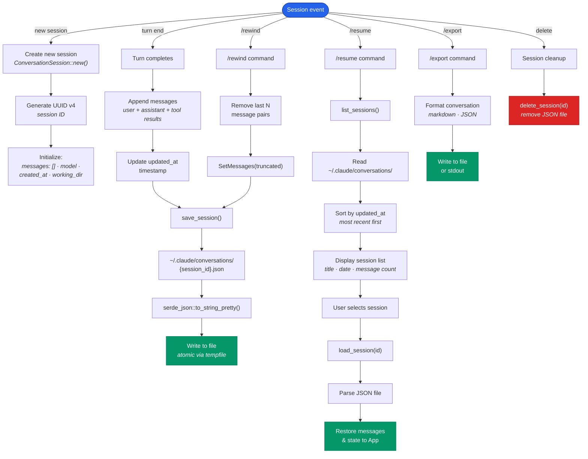

---

## Quick Reference — All Tool Names

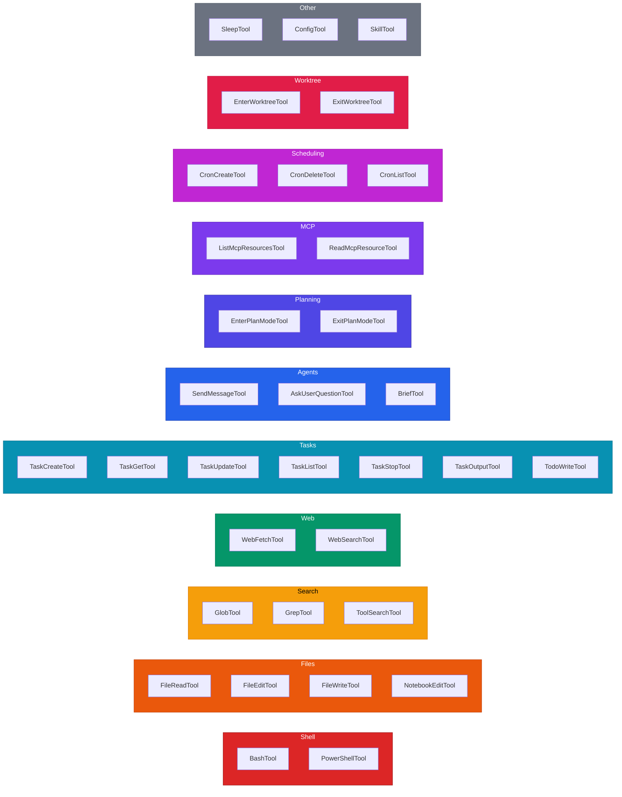
